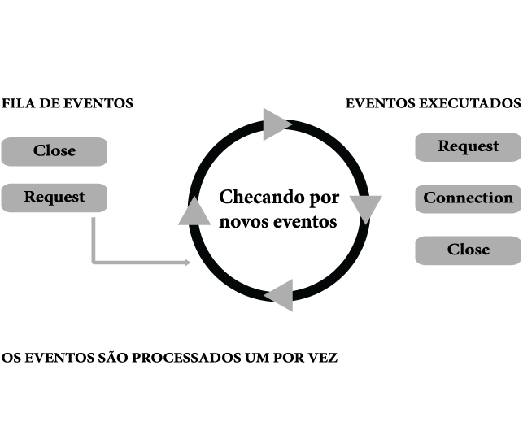
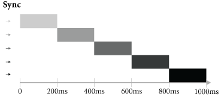
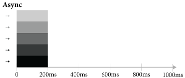

O ambiente Node.Js
==================

Programação Orientada a eventos
-------------------------------

PEREIRA (2012) compara que o Node.Js orientado a eventos se espelha na filosofia de orientação a eventos
utilizado pelo JavaScript nos navegadores; a diferença entre eles é que no  Node.Js não existe eventos
de clique do mouse, teclas pressionadas do teclado (*keyup*) ou qualquer evento de componentes HTML.
No Node.Js os eventos trabalhados são entrada e saída do servidor como eventos de conexão ao banco de dados,
abertura de arquivo e um dado de um *streaming*, dentre muitos outros.

Single – Thread
---------------

Uma das melhores maneiras para entender o *single-thread*  é descrita por Croucher * Wilson (2012)
fazendo uma analogia a nossa vida, segue síntese do texto abaixo:

Na vida cotidiana, estamos acostumados todos os tipos de retorno de chamadas internas para lidar com eventos, e ainda, como JavaScript fazemos apenas
uma coisa de cada vez. De maneira divertida Croucher & Wilson (2012) exemplifica que você é capaz de esfregar a barriga e coçar a cabeça, ao mesmo tempo, certo!?
Mas se você realizar uma atividade mais grave, ao mesmo tempo, algo irá dar errado muito rapidamente.
Isto é como JavaScript.
É ótimo as ações serem conduzidas por eventos mas no *single-thread* apenas uma coisa acontece ao mesmo tempo.

Para Croucher & Wilson (2012) o conceito *single-threaded* é muito importante porém é uma das críticas feitas ao Node.Js é a falta de concorrência.
Quando Croucher & Wilson (2012) pronunciou falta de concorrência quis dizer que não é utilizado todas as CPU's de um computador.
Segundo estes autores o problema de executar códigos em várias CPU's de uma vez é que ele requer uma coordenação entre várias “linhas” de execução.
Para que várias CPU's possam dividir de maneira eficaz o trabalho, é necessário que eles conversem entre si sobre o estado atual do programa, e o que cada single *thread* havia feito.

Croucher & Wilson não descarta a possibilidade de concorrência mas que é um modelo mais complexo e que exige
mais esforço do desenvolvedor e do sistema. 

De acordo com Pereira (2012), em Node.Js nativamente não é possível trabalhar com programação concorrente em plataforma *multi-thread*.
Mas que existem maneiras de se implementar sistemas concorrentes, como por exemplo, utilizar *clusters* o qual é um módulo nativo
do ambiente Node.Js.

Além disso, é possível compartilhar sockets entre processos através da biblioteca
multi-node (Zyp, 2010), sendo assim, pode-se ter múltiplos nós de servidores de processos
trabalhando  em paralelo, cada um em core do processador, mas ATENDENDO/ESCUTANDO a mesma porta,
assim o próprio SO atua como balanceador de carga. (Junior, 2012)

Powers (2012) cita também o single *thread* como um dos benefícios do ambiente do Node.Js pois o aplicativo pode ser
facilmente escalável uma vez que em um único segmento de execução não ha uma enorme sobrecarga de requisições.
Citando o exemplo de seu livro, ao criar uma aplicação em PHP semelhante à aplicação Node.Js o usuário veria a mesma página,
mas no código *backend* do sistema ira notar-se a diferença.

Se executar esse aplicativo PHP no servidor web Apache , cada pedido que for solicitado irá ser tratado em um processo filho separado.
As possibilidades são, a menos que você tem um sistema de carregamento eficiente,
você só vai ser capaz de executar mais um par de centenas de processos filhos em paralelo.
Mais do que esse número de pedidos significa que um cliente precisa esperar por uma resposta. (POWERS, 2012)

Deste modo, um servidor Node.js pode suportar dezenas de milhares de conexões
simultâneas, pois ele altera todo o contexto do servidor e o único gargalo passa a ser a
capacidade de tráfego de um sistema e não mais o número de conexões. (Abernethy, 2011)

Chamadas de retorno e chamadas de retorno infernais
---------------------------------------------------

De acordo com Wilson (2013) o JavaScript utiliza de *callbacks* para abordar o problema a partir do lado oposto;
ao invés de gerenciar processos de execução prolongada, os desenvolvedores associam eventos específicos e
escrevem funções especiais, chamadas *callbacks*, que são executadas quando o critério do evento é atingido.

Evitando chamadas de retorno infernais
^^^^^^^^^^^^^^^^^^^^^^^^^^^^^^^^^^^^^^

Pereira (2012) relata que é o JavaScript é perfomático trabalhando de forma assíncrona  porém em certos
momentos do desenvolvimentos, inevitavelmente será implementado diversas funções assíncronas encadeadas
umas nas outras através das suas funções *callbacks*.

.. code-block:: javascript
    :linenos:

    var fs = require('fs');
    fs.readdir(__dirname, function(erro, contents) {
        if (erro) { throw erro; }
        contents.forEach(function(content) {
            var path = './' + content;
            fs.stat(path, function(erro, stat) {
                if (erro) { throw erro; }
                if (stat.isFile()) {
                    console.log('%s %d bytes', content, stat.size);
                }
            });
        });
    });

Com o código exemplificado por Pereira (2012) temos uma simples leitura dos arquivos do diretório e imprimindo
o nome e o tamanho em bytes.
Com este exemplo Pereira (2012) nos demonstra que uma simples tarefa possui muitos encadeamentos e nos questiona
como seria a organização caso seja uma função complexa.
Praticamente o código implementado seria um caos e de difícil manutenabilidade. 

Pela linguagem JavaScript ser assíncrona Pereira (2012) afirma que neste amaranhado de *callbacks* 
podemos perder o controle do que está sendo executado, perder acesso a variáveis devido a troca de escopos
em troca de ganhos com a performance.

Nos *callbacks* do Node.Js é importante atentar como feito por Pereira (2012) que em sua maioria possuem
como parâmetro uma variável de erro.
Caso exista esse parâmetro é recomendado por Pereira (2012) realizar o tratamento deles na execução do *callback*
impedindo a execução aleatória quando for identificado um erro.

Existem várias maneiras de se evitar o temido *callback hell*, como sugerido por Pereira (2012), uma boa prática
de código JavaScript é criar funções que expressem seu objetivo e de forma isoladas, 
salvando em variável e passando-as em *callback*.
Veja o exemplo abaixo do arquivo *callback_heaven.js* criado por Pereira (2012).

.. code-block:: javascript
    :linenos:

    var fs = require('fs');
    var lerDiretorio = function() {
        fs.readdir(__dirname, function(erro, diretorio) {
            if (erro) return erro;
            diretorio.forEach(function(arquivo) {
                ler(arquivo);
            });
        });
    };

    var ler = function(arquivo) {
        var path = './' + arquivo;
        fs.stat(path, function(erro, stat) {
            if (erro) return erro;
            if (stat.isFile()) {
                console.log('%s %d bytes', arquivo, stat.size);
            }
        });
    };

    lerDiretorio();

Como dito por Pereira (2012) houve uma melhora na legibilidade do código, deixando mais semântico e legível
o nome das funções. O número de *callbacks* encadeados também diminui.
Pereira (2012) sugere como boa prática manter no máximo dois encadeamentos de *callback*, caso passe esse número
é interessante criar uma função externa para ser passada como parâmetro nos *callbacks*, ao invés de continuar criando *callbacks hell*.

.. warning::

    Novas técnicas de callback hell:

    `Artigo 1`_

.. _Artigo 1: http://strongloop.com/strongblog/node-js-callback-hell-promises-generators/

Outras técnicas foram apresentadas pela empresa Strongloop (http://strongloop.com, recuperado em 31, agosto, 2014),
mantenedora do projeto *open source* Express.Js, que escreveu um excelente artigo com estas técnicas

Neste artigo a empresa apresenta o problema semelhante ao de Pereira(2012) tendo definido os seguintes passos para sua implementação:
    * Ler os arquivos em um diretório
    * Receber os *status* de cada arquivo
    * Determinar qual é o maior arquivo
    * *Callback* ou retorno com o nome do maior arquivo

Primeiro, usa-se como exemplo a abordagem aninhada com vários *callbacks*, mas que seguem alógica descrita acima.

.. code-block:: javascript
    :linenos:
    :emphasize-lines: 5,12,18,20,22,23,27

    var fs = require('fs')
    var path = require('path')

    module.exports = function (dir, cb) {
        fs.readdir(dir, function (er, files) { // [1]
            if (er) return cb(er)
            var counter = files.length
            var errored = false
            var stats = []

            files.forEach(function (file, index) {
                fs.stat(path.join(dir,file), function (er, stat) { // [2]
                    if (errored) return
                    if (er) {
                        errored = true
                        return cb(er)
                    }
                    stats[index] = stat // [3]

                    if (--counter == 0) { // [4]
                        var largest = stats
                        .filter(function (stat) { return stat.isFile() }) // [5]
                        .reduce(function (prev, next) { // [6]
                            if (prev.size > next.size) return prev
                            return next
                        })
                        cb(null, files[stats.indexOf(largest)]) // [7]
                    }
                })
            })
        })
    }

Vamos explicar o que cada linha representa.

1. Ler todos os arquivos do diretório.
2. Para cada arquivo, obtêm seus *status*.
3. Coleta os *status* do arquivo.
4. Verifica se as operações em paralelo foram concluídas.
5. Resgata somente arquivos normais, não incluindo diretórios e links.
6. Reduz a lista para pegar o maior arquivo
7. Pega o nome do arquivo associado ao status

A implementação exemplificada acima é eficaz em resolver o problema no entanto, é complicado gerenciar o paralelismo das 
da funções de retorno e não saber qual *callback* está em execução. 

Partindo deste exemplo apresenta-se a primeira técnica, que é modularizar e isolar as funções utilizadas como foi sugerido por
Pereira(2012) no inicio desta seção. Veja abaixo o código gerado.

.. code-block:: javascript
    :linenos:

    function getStats (paths, cb) {
        var counter = paths.length
        var errored = false
        var stats = []
        paths.forEach(function (path, index) {
            fs.stat(path, function (er, stat) {
                if (errored) return
                if (er) {
                    errored = true
                    return cb(er)
                }
                stats[index] = stat
                if (--counter == 0) cb(null, stats)
            })
        })
    }

    function getLargestFile (files, stats) {
        var largest = stats
        .filter(function (stat) { return stat.isFile() })
        .reduce(function (prev, next) {
            if (prev.size > next.size) return prev
            return next
        })
        return files[stats.indexOf(largest)]
    }

    var fs = require('fs')
    var path = require('path')

    module.exports = function (dir, cb) {
        fs.readdir(dir, function (er, files) {
            if (er) return cb(er)
            var paths = files.map(function (file) { // [1]
                return path.join(dir,file)
            })

            getStats(paths, function (er, stats) {
                if (er) return cb(er)
                var largestFile = getLargestFile(files, stats)
                cb(null, largestFile)
            })
        })
    }

Conforme dito por Pereira(2012) e agora pela empresa com a modularização é possível reutilizar o código gerado
e testar as funções muito mais fácil. Entretanto a tarefa para buscar os *status* do arquivo está sendo realizada
e implementada manualmente. 

Para isso tem-se módulos no Node.Js que realizam melhor esse controle de fluxo.

Abordagem assíncrona
~~~~~~~~~~~~~~~~~~~~

O módulo **async** [#f1]_ é o mais popular entre os desenvolvedores e fica próximo do *core* (núcleo) do Node.Js.

.. code-block:: javascript
    :linenos:
    :emphasize-lines: 6, 13, 26

    var fs = require('fs')
    var async = require('async')
    var path = require('path')

    module.exports = function (dir, cb) {
        async.waterfall([ // [1]
            function (next) {
                fs.readdir(dir, next)
            },
            function (files, next) {
                var paths = 
                files.map(function (file) { return path.join(dir,file) })
                async.map(paths, fs.stat, function (er, stats) { // [2]
                    next(er, files, stats)
                })
            },
            function (files, stats, next) {
                var largest = stats
                .filter(function (stat) { return stat.isFile() })
                .reduce(function (prev, next) {
                    if (prev.size > next.size) return prev
                    return next
                })
                next(null, files[stats.indexOf(largest)])
            }
        ], cb) // [3]
    }

1. *async.waterfall* provê um um controle de execução em série, em que os dados a partir
de uma operação pode ser passado para a próxima função usando o retorno de chamada **next**.
2. *async.map* nos permite executar o comando *fs.stat* sobre um *array* de caminhos em paralelo
e é retornado um *array* com a ordem mantida dos resultados. 
3. A função **cb** será chamada na conclusão da função ou se em algum momento da execução 
houver algum erro. Lembrando que é executado somente uma vez.

Como dito pela Strongloop, este módulo garante que somente um *callback* será retornado e também irá
propagar erros e controlar o paralelismo para o desenvolvedor.

Abordagem utilizando promises
~~~~~~~~~~~~~~~~~~~~~~~~~~~~~

*Promises* fornece tratamento de erros e as regalias da programação funcional. Conforme a Strongloop é necessário
utilizar o módulo **Q** [#f2]_ mas nada impede que se use outras bibliotecas de *Promises* sejam empregadas.

.. code-block:: javascript
    :linenos:
    :emphasize-lines: 4, 13, 14, 17

    var fs = require('fs')
    var path = require('path')
    var Q = require('q')
    var fs_readdir = Q.denodeify(fs.readdir) // [1]
    var fs_stat = Q.denodeify(fs.stat)

    module.exports = function (dir) {
        return fs_readdir(dir)
        .then(function (files) {
            var promises = files.map(function (file) {
                return fs_stat(path.join(dir,file))
            })
            return Q.all(promises).then(function (stats) { // [2]
                return [files, stats] // [3]
            })
        })
        .then(function (data) { // [4]
            var files = data[0]
            var stats = data[1]
            var largest = stats
            .filter(function (stat) { return stat.isFile() })
            .reduce(function (prev, next) {
                if (prev.size > next.size) return prev
                return next
            })
            return files[stats.indexOf(largest)]
        })
    }

1. Desde a funcionalidade central do Node.Js não existe os **promises**   
2. *Q.all* executa todas as chamadas de status dos arquivos em paralelo e retorna um *array* com as ordem dos resultados 
mantido.
3 e 4. Passa os arquivos e *status* para a próxima função que então retorna o maior arquivo.

A StrongLoop relata que ao contrário dos exemplos anteriores, quaisquer exceções são lançadas dentro da cadeia de *promises*,
somente depois são capturadas e manipuladas. Ha também uma mudança para chamar esse módulo seguindo essa abordagem.

.. code-block:: javascript
    :linenos:

    var findLargest = require('./findLargest')
    
    findLargest('./path/to/dir')
    .then(function (er, filename) {
        console.log('largest file was:', filename)
    })
    .catch(console.error)

Abordagem com generators
~~~~~~~~~~~~~~~~~~~~~~~~

Conforme descrito pela StrongLoop os *generators* estarão oficialmente integrado ao Node.Js nas versões
posteriores a 0.11.2.

*Generators* são co-rotinas leves para o JavaScript. Os *generators* permitem que uma função possa ser
suspensa e retomada utilizando a palavra chave **yield**. Para habilitar os *generators* utilize o módulo **co** [#f3]_.

.. code-block:: javascript
    :linenos:
    :emphasize-lines: 5,8,9,10,20

    var co = require('co')
    var thunkify = require('thunkify')
    var fs = require('fs')
    var path = require('path')
    var readdir = thunkify(fs.readdir) // [1]
    var stat = thunkify(fs.stat)

    module.exports = co(function* (dir) { // [2]
        var files = yield readdir(dir) // [3]
        var stats = yield files.map(function (file) { // [4]
           return stat(path.join(dir,file))
        })

        var largest = stats
            .filter(function (stat) { return stat.isFile() })
            .reduce(function (prev, next) {
                if (prev.size > next.size) return prev
                return next
            })
        return files[stats.indexOf(largest)] // [5]
    })

1. Desde a funcionalidade central do Node.Js não existe os **promises**   
2. **co** é uma função *generator* que pode ser suspensa utilizando a palavra *yield*
3. A função *generator* será suspensa até a função *readdir* retornar. O resultado será atribuída a variável files
4. **co** também pode manipular *arrays* e setar operações paralelas para execução. O *array* com os resultados é atribuído e 
com a ordem mantida
5. Por fim é retornado o resultado.

.. [#f1] https://github.com/caolan/async
.. [#f2] https://github.com/kriskowal/q
.. [#f3] https://github.com/visionmedia/co

O módulo **Co** possui uma agradável manipulação de erros (incluindo exceções levantadas) serão passadas para a função de retorno 
**callback**. Os *generators* também habilitada o uso de blocos *try/catch* em torno das declarações *yield*. Além disso **Co**
suporta *arrays*, objetos, *generators* aninhados, *promises*.

.. code-block:: 
    :linenos:

    try {
        var files = yield readdir(dir)
    } catch (er) {
        console.error('something happened whilst reading the directory')
    }
    
A empresa StrongLoop investigou três possibilidades de mitigar o problema das chamadas de retorno infernais, para obtenção
do controle de fluxo da aplicação. Houve um interesse maior da empresa pelo dos *Generators* apesar de não empregar em
seus projetos e observar para os módulos de terceiros ela recomenda utilizar a modularização em qualquer um das bibliotecas
*(async, promises e generators)*

Ciclo de eventos
----------------

Ao introduzir esse assunto Pereira (2012) diz que o ciclo de eventos - *Event-Loop* - é o agente responsável
por escutar e emitir eventos dentro do sistema.
Pereira (2012) rapidamente explica essa teoria do paradigma orientação a eventos o ciclo de eventos é uma repetição infinita
que a cada interação verifica em sua fila de eventos se um determinado evento foi emitido ou se existem novos eventos.
Estes eventos só aparecem na fila quando são emitidos durante as suas interações na aplicação; quando ocorre,  é emitido um evento,
então este evento é executado e enviados para a fila de executados. 

Wilson (2013) enaltece os eventos como sendo a alma do Node.Js e do JavaScript.
Complementando Wilson (2013) afirma que outras linguagens de programação lidam com fluxos de trabalho em *threads*
múltiplas e concorrentes, com cada *thread*  gastando a maioria de seu tempo aguardando operações
bloqueadoras de entrada e saída como leitura ou escrita em disco, manipulação do banco de dados ou acesso a informações pela rede.

Veja a figura abaixo [Ref]_ 

.. [Ref] Retirado do livro Aplicações web real-time com Node.Js 

Wilson (2013) escreve uma das qualidades do JavaScript, que foi criado seguindo o modelo de programação orientado a eventos.
Sendo desde um simples clique de mouse, carregamento de páginas ou envio de formulários, todos utilizando o modelo baseado em eventos.

O *event-loop* – cilo de eventos – é o sistema que usa o JavaScript para lidar com os pedidos recebidos
de várias partes do sistema de uma forma sadia. Há uma série de maneiras como as pessoas lidam com o “tempo real” ou questões “paralelas” em computação.
A maioria deles são bastante complexos e fazem o cérebro doer.
O JavaScript tem uma abordagem simples que torna o processo muito mais compreensível,
mas introduz algumas restrições.
Possuindo uma ideia de como o ciclo de eventos funciona, o desenvolvedor é capaz de usá-lo em toda sua potencialidade,
conseguindo vantagens e evitando armadilhas dessa abordagem.( Croucher & Wilson, 2012)

.. warning ::
  
    Corrigir o ( Tom Hughes-Croucher e Mike Wilson, 2012)

Pensamos que a maioria das pessoas entendem intuitivamente a programação orientada a eventos, porquê é como a vida cotidiana. 
Imagine que você esta cozinhando. Você esta cortando um pimentão e uma panela começa a ferver. Você termina de cortar e, em seguida desliga o fogão.
Ao invés de tentar cortar e desligar o fogão, ao mesmo tempo, você irá alcançar o mesmo resultado de uma forma mais segura 
através dessa rápida mudança de contextos.

A programação orientada a eventos faz a mesma coisa. Ao permitir que o desenvolvedor escreva código que só trabalhe em um retorno
de chamada de cada vez, o programa será compreensível e também capaz de executar rapidamente várias tarefas de forma eficiente.( Croucher & Wilson, 2012)

.. warning ::
  
    Corrigir o ( Tom Hughes-Croucher e Mike Wilson, 2012)

Continuando, como apresentado por Pereira (2012) o *EventEmitter*, é o módulo responsável por por emitir estes eventos e em
grande maioria das bibliotecas do ambiente Node.Js utiliza as funcionalidades de eventos deste módulo.
No processo de execução do evento pode-se programar qualquer lógica de programação através do mecanismo de
*callback* - chamada de retorno - , tal *callback* - chamada de retorno -pode ser executado através de uma função de escuta, semanticamente conhecida pelo *on()*.

Essa seção é bem descrita e exemplificada por Wilson (2013) em seu livro que nos mostra o uso e o desenvolvimento de eventos.

.. code-block:: javascript
    :linenos:

    var events = require('events')
    var eventEmitter = new events.EventEmitter();

    function mainLoop() {
        console.log('Starting application');
        eventEmitter.emit('AplicationStart');

        console.log('Running application');
        eventEmitter.emit('AplicationRun');
        
        console.log('Stopping application');
        eventEmitter.emit('AplicationStop');
    }

    function onApplicationStart() {
        console.log('Handling Application Start Event');
    }

    function onApplicationRun() {
        console.log('Handling Application Run Event');
    }

    function onApplicationStop() {
        console.log('Handling Application Stop Event');
    }

    eventEmitter.on('ApplicationStart', onApplicationStart);
    eventEmitter.on('ApplicationRun', onApplicationRun);
    eventEmitter.on('ApplicationStop', onApplicationStop);

    mainLoop();

Segundo Wilson (2013) o exemplo acima demonstra como três funções não relacionadas **onApplicationStart**, 
**onApplicationRun** e **onApplicationStop** podem ser encadeadas para produzir a saída ::

    Starting application
    Handling Application Start Event

    Running application
    Handling Application Run Event

    Stopping application
    Handling Application Stop Event

Os eventos **ApplicationStart, ApplicationRun e ApplicationStop** são registrados utilizando o *eventEmitter* no método
antes de a função **mainLoop** ser executada. Isso inclui um ouvinte de evento para cada um desses eventos - de agora em diante,
sempre que qualquer evento for levantado, ele será verificado de acordo com esses ouvintes para determinar se uma correspondência
está disponível, caso em que a função de *callback* - chamada de retorno - dessa correspondência será executada. (WILSON, 2013)

A saída de tela destaca um traço importante do Node.Js: todo o seu trabalho é feito em uma única *thread*. Quando um evento é levantado
e respondido por um *callback* - chamada de retorno -, o método de chamada é pausado enquanto o *callback* é executado. Isso é importante 
porque, se algo acontecer durante o *callback* e consumir bastante tempo de processamento, a função original não vai continuar
sendo executada até que todo o trabalho esteja completado. (WILSON, 2013)

.. warning ::

    Não entendi essa última parte o Node.Js não é bloqueante. Mas em eventos eles espera o processamento terminar?

Assim, a execução desse exemplo segue o caminho: ::

    1. Executa mainloop, dispara ApplicationStartEvent.
    2. Executa o callback onApplicationStart.
    3 Continua a execução de mainloop, dispara ApplicationRun.
    4. Executa o callback onApplicationRun.
    5. Continua a execução de mainloop, dispara ApplicationStop.
    6. Executa o callback onApplicationStop.
    7. Retorna para a execução de mainLoop, não há mais nada a fazer; para.

Finalizando esta seção, Pereira (2012) diz que o *event-driven* do Node.Js foi inspirado pelos frameworks
Event Machine do Ruby e Twisted do Python, porém o ciclo de eventos do Node.Js é mais perfomático pois seu mecanismo
é nativamente executado de forma não bloqueante sendo o diferencial em relação a outros ambientes de programação.

Por que usar assíncrono
-----------------------

No ambiente de desenvolvimento Node.Js é importante entender e saber trabalhar com as chamadas assíncronas.
Pereira (2012) exemplifica em código as diferenças entre uma função síncrona e assíncrona em relação ao tempo
em que são executadas.
O código é para criar uma repetição de 5 interações e a cada iteração desta repetição será criado um arquivo texto.

.. code-block:: javascript
    :linenos:

    var fs = require('fs');
    
    for(var i = 1; i <= 5; i++) {
        var file = "sync-txt" + i + ".txt";
        var out = fs.writeFileSync(file, "Hello Node.js!");
        console.log(out);
    }

Veja o tempo gasto no modelo síncrono [Ref]_:

.. [Ref] Retirado do livro Aplicações web real-time com Node.Js 

.. code-block:: javascript
    :linenos:

    var fs = require('fs');
    
    for(var i = 1; i <= 5; i++) {
        var file = "async-txt" + i + ".txt";
        fs.writeFile(file, "Hello Node.js!", function(err, out) {
            console.log(out);
        });
    }

Threads versus Assincronismos
^^^^^^^^^^^^^^^^^^^^^^^^^^^^^

De acordo com Pereira (2012) por mais que as funções assíncronas possam executar em paralelo várias tarefas,
elas jamais serão consideradas uma *Thread* ( como *Threads* do java).
A diferença é que as *Threads* são manipuláveis pelo desenvolvedor, ou seja, você pode pausar a execução de uma *Thread*
ou fazê-la esperar o término de uma outra.
Chamadas assíncronas apenas invocam suas funções numa ordem de que você não tem controle,
e você só sabe quando uma chamada terminou quando seu *callback* é executado. 

Pode parecer vantajoso ter controle sobre *Threads* a favor de um sistema que executa tarefas em paralelo,
mas pouco domínio sobre eles pode transformar seus sistema em um caos de travamentos *deadlocks*, 
afinal *threads* são executadas de forma bloqueante. Este é o grande diferencial das chamadas assíncronas,
elas executam em paralelo suas funções sem travar processamento das outras e principalmente sem bloquear o sistema principal.

.. warning:: 

    Aqui deveria mostrar um exemplo de código em python e outro em node?

    `Code Python 1`_
    `Code Python 2`_
    `Code Python 3`_
    `Code Python 4`_
    `Code Python 5`_

.. _Code Python 1: http://www.vivaolinux.com.br/artigo/Threads-Importancia-dentro-de-um-software?pagina=1

.. _Code Python 2: http://medeubranco.wordpress.com/2008/07/10/threads-em-python/

.. _Code Python 3: http://imasters.com.br/artigo/20127/py/threads-em-python/

.. _Code Python 4: http://pythonrs.wordpress.com/2010/03/12/python-com-threads/

.. _Code Python 5: http://darkstrikerd.wordpress.com/2012/04/12/threads-simples-com-python/

    

Como dito por Pereira (2012) é essencial que seu código Node.Js invoque o mínimo possível de funções bloqueantes.
Toda função síncrona impedirá, naquele instante, que o Node.Js continue executando os demais códigos até que aquela
função seja finalizada.
Por exemplo, se essa função fizer uma operação de entrada e saída em disco, vai bloquear o sistema inteiro,
deixando o processador ocioso enquanto é utilizado outros recursos de hardware.

Construindo a API REST com o framework Express.js
-------------------------------------------------

Porque a escolha do express.js
^^^^^^^^^^^^^^^^^^^^^^^^^^^^^^

Powers(2012) descreve que um framework fornece suporte de infraestrutura que nos permite criar sites e aplicações mais rapidamente,
fornecendo ao desenvolvedor um esqueleto sobre o qual construir e manusear muitos aspectos mundanos e ubíquos do processo
de desenvolvimento de software e focar na criação de funcionalidades da nossa aplicação ou site.
Também fornece coesão ao código, o que pode tornar o código mais fácil de gerenciar e manter.

Pereira(2012) complementa que utilizar a API HTTP nativa do Node.Js pode ser algo trabalhoso e desgastante.
Conforme surge novas necessidades de implementar novas funcionalidades, códigos gigantescos seriam acrescentados,
aumentando a complexidade do projeto e dificultando futuras manutenções.

Assim surge o framework Express.Js que conforme Powers(2012) é mais parecido com o framework Sinatra e é bem mais RESTFUL.
Pereira(2012) reafirma que este módulo de desenvolvimento foi inspirado pelo framework Sinatra na linguagem Ruby
e que é bastante utilizado para aplicações web de grande escala.

Suas características são descritas por Pereira(2012):

* MVR ( Model View Routes)
* MVC ( Model View Controller)
* Roteamento de urls via callbacks
* Middleware
* Interface RESTFul
* Suporte a File Uploads
* Configuração baseada em variáveis de ambiente
* Suporte a helpers dinâmicos
* Integração com Templates Enginies
* Integração com SQL e NoSQL

Instalação e configuração
^^^^^^^^^^^^^^^^^^^^^^^^^

Para instalar o framework é necessário termos o Node.Js instalado no sistema e o gerenciador de pacote *NPM* ( Node Package Manager).
POWERS (2012) descreve que a instalação do Express.Js deve ser feita com o comando:

.. code-block:: bash
    
    npm install express

Enquanto Pereira (2012) recomenda que ao instalar o Express.Js pelo NPM – Node Package Manager – deve se utilizar a opção -g ( modo global) par aproveitar todos os recursos.

.. code-block:: bash
    
    sudo npm install -g express

Após a instalar o Express.Js  é necessário fechar e abrir o terminal para habilitar o comando *express* no PATH
do seu sistema operacional. Pereira (2012) descreve o comando *express* como um CLI - Command Line Interface –
permitindo criar uma aplicação com suporte a sessões, Template Enginie - motores de templates – e CSS enginie – motores de css -.
Para saber todas as opções do comando *express* utilize a opção -h.

Criando um projeto
^^^^^^^^^^^^^^^^^^

Com base nos aspectos abordados ao longo deste trabalho, este capítulo visa apresentar o desenvolvimento de um Web Service seguindo os padrões REST e a utilização de um banco de dados relacional Postgres para a persistência dos dados.

Tal serviço possuirá métodos que serão consumidos por um dispositivos clientes.
Seguindo modelos do framework SCRUM, as funcionalidades da aplicação serão descritas em estórias e tarefas relacionadas.

Elicitação de requisitos
~~~~~~~~~~~~~~~~~~~~~~~~

O objetivo deste tópico é aplicar os conhecimentos adquiridos nos capítulos anteriores e criar uma aplicação em REST.

1. A aplicação API REST deverá ser compatível com todas as versões para computadores com os navegadores web Mozilla Firefox e Google Chrome.

2. Não será utilizado técnicas de autenticação na API.

3. A API REST deverá responder as requisições do cliente através da representação em JSON.

4. A API REST deverá persistir os dados em Postgres.

5. A API REST deverá ter um recurso chamado Contatos.

6. A API REST deverá prover estratégias para manipular as ações de *CRUD* de um contato(s).

Contatos
Contatos são coleções de contatos, com seus respectivos documentos e informações. 

+--------------------+-------------------------------------------------------------------------------+
|Recurso             |Descrição                                                                      |
+====================+===============================================================================+
| GET contatos       | Retorna a lista de  contatos cadastrados no banco de dados                    |
+--------------------+-------------------------------------------------------------------------------+
| GET contatos/:id   | Retorna a informação do contato, representado pelo id do documento passado.   | 
+--------------------+-------------------------------------------------------------------------------+
| POST contatos/     | Cria um novo  contato e persiste os dados no banco.                           |
+--------------------+-------------------------------------------------------------------------------+
| PUT contatos/:id   | Atualiza as informações do contato, representado pelo id do documento passado.|
+--------------------+-------------------------------------------------------------------------------+
| DELETE contatos/:id| Destrói o contato, representado pelo id do documento passado.                 |
+--------------------+-------------------------------------------------------------------------------+

Tecnologias Utilizadas
~~~~~~~~~~~~~~~~~~~~~~

Aplicativo Node.JS

* Node.Js – Ambiente de Programação Backend para apresentação deste trabalho
* Postgress – Banco de dados relacional 
* Express – Framework para aplicações web
* Nginx – Servidor Web de alta performance para arquivos estáticos

Aplicativo comparativo Django

* Python – Linguagem de programação OO usada na comparação de aplicativos deste trabalho
* Postgress – Banco de dados relacional
* Django/jango-rest-framewor – Framework Django para aplicações web e o pacote django-rest-framework para facilitar o desenvolvimento.
* Nginx – Servidor Web de alta performance para arquivos estáticos

.. warning::

    Se houver tempo fazer também aplicativos com o Sinatra e Ruby

Criando o esqueleto do projeto
~~~~~~~~~~~~~~~~~~~~~~~~~~~~~~

Conforme o exemplo abaixo criamos o projeto utilizando os comandos de Powers(2012) e Pereira(2012) utiliza.

.. code-block:: bash
    :linenos:

    $ express --css stylus rest-node

    create : rest-node
    create : rest-node/package.json
    create : rest-node/app.js
    create : rest-node/public
    create : rest-node/public/javascripts
    create : rest-node/public/images
    create : rest-node/public/stylesheets
    create : rest-node/public/stylesheets/style.styl
    create : rest-node/routes
    create : rest-node/routes/index.js
    create : rest-node/routes/users.js
    create : rest-node/bin
    create : rest-node/bin/www
    create : rest-node/views
    create : rest-node/views/index.jade
    create : rest-node/views/layout.jade
    create : rest-node/views/error.jade

    install dependencies:
    $ cd rest-node && npm install

    run the app:
    $ DEBUG=rest-node ./bin/www

Em seguida, acesse o diretório criado e veja as explicações de cada arquivo e diretório.

.. code-block:: bash
    :linenos:

    $ ls -l
    total 24
    -rw-rw-r-- 1 lucas lucas 1447 Ago 28 10:32 app.js
    drwxr-xr-x 2 lucas lucas 4096 Ago 28 10:32 bin
    -rw-rw-r-- 1 lucas lucas  350 Ago 28 10:32 package.json
    drwxr-xr-x 5 lucas lucas 4096 Ago 28 10:32 public
    drwxr-xr-x 2 lucas lucas 4096 Ago 28 10:32 routes
    drwxr-xr-x 2 lucas lucas 4096 Ago 28 10:32 views

Powers (2012), Croucher & Wilson (2012) não apresentam um descritivo de cada arquivo ou diretório e seu papel.
Entretanto Pereira (2012) e Wilson (2013) aprofundam mais neste assunto. 

* package.json:
  Pereira(2012) diz que este arquivo contém as principais informações sobre a aplicação como:
  nome, autor, versão, colaboradores, *URL*, dependências e outros.

* public:
  pasta publica que armazena código estático como imagens, css e javascript.

* app.js:
  Wilson (2013) descreve melhor esse arquivo como ponto de entrada para a aplicação Node.Js,
  sendo capaz executar o servidor através do comando: *node app.js*

* routes:
  Pereira (2012) descreve como diretório que mantém todas as rotas da aplicação.
  Na versão utilizada por Wilson (2013) em seu livro o Express.Js não possui este diretório. 

* views:
  Wilson (2013) descreve que esta pasta contém os motores de template (Jade ou EJS), que são renderizados
  pelo servidor Express.Js e enviados ao cliente.
  Pereira (2012) simplifica descrevendo que é um diretório que contém todas as visões renderizadas pelas rotas.

O arquivo de *package.json*, de acordo com Wilson (2013) sempre é necessário
ser criado em seu projeto e que ele é responsável por fornecer detalhes sobre as
condições de operação e configuração esperadas por seu código.
Wilson (2013) complementa que este arquivo ajuda a prevenir que alterações futuras em
módulos de terceiros quebrem a lógica da aplicação.

No livro Construindo Aplicações Node com MongoDB e Backbone, Wilson (2013) exibe um exemplo do arquivo *package.json*
o qual é utilizado para sincronizar a aplicação com dependências, sendo importante associar a aplicação
a uma versão especifica. No exemplo podemos ver que o Express.Js está na versão 4.2.0,
tal como *Debug* versão 0.7.4 ou posteriores.

Maiores detalhes sobre os caracteres “~”, “>=”, “ ou “^” podem ser vistos na documentação do *NPM* em semver. 

.. warning::

    Como colocar uma referencia para o semver conforme descrito no ultimo paragrafo. Esse acesso ao link
    ja esta na bibliografia.

.. code-block:: bash
    :linenos:

    {
        "name": "rest-node",
        "version": "0.0.1",
        "private": true,
        "scripts": {
            "start": "node ./bin/www"
        },
        "dependencies": {
            "express": "~4.2.0",
            "static-favicon": "~1.0.0",
            "morgan": "~1.0.0",
            "cookie-parser": "~1.0.1",
            "body-parser": "~1.0.0",
            "debug": "~0.7.4",
            "jade": "~1.3.0",
            "stylus": "0.42.3"
        }
    }

Após a conhecer a estrutura da aplicação podemos executar o comando *npm install*
dentro do diretório do projeto para instalar as dependências existentes no *package.json* 

.. code-block:: bash
    :linenos:

    body-parser@1.0.2 node_modules/body-parser
    ├── qs@0.6.6
    ├── type-is@1.1.0 (mime@1.2.11)
    └── raw-body@1.1.7 (bytes@1.0.0, string_decoder@0.10.31)

    express@4.2.0 node_modules/express
    ├── parseurl@1.0.1
    ├── merge-descriptors@0.0.2
    ├── utils-merge@1.0.0
    ├── cookie@0.1.2
    ├── escape-html@1.0.1
    ├── cookie-signature@1.0.3
    ├── range-parser@1.0.0
    ├── fresh@0.2.2
    ├── qs@0.6.6
    ├── methods@1.0.0
    ├── serve-static@1.1.0
    ├── path-to-regexp@0.1.2
    ├── buffer-crc32@0.2.1
    ├── debug@0.8.1
    ├── send@0.3.0 (debug@0.8.0, mime@1.2.11)
    ├── type-is@1.1.0 (mime@1.2.11)
    └── accepts@1.0.1 (negotiator@0.4.7, mime@1.2.11)

Servidor Web
^^^^^^^^^^^^

No framework Express.Js  temos um servidor web para desenvolver nossa aplicação. Wilson (2013)
relata que muitos desenvolvedores  que possui um histórico “tradicional” configuram um software
para o servidor web – Apache, Nginx ou IIS – para ser um canal de comunicação entre o navegador
e o código da aplicação.
Atualmente com o surgimento de novas tecnologias de programação como Ruby on Rails, Django e PHP 5.4
têm mecanismos para inicializar um servidor de desenvolvimento local.
Este item incluso dentro do framework visa agilizar o desenvolvimento das aplicações no menor tempo possível.

Complementando este capitulo de acordo com Wilson (2013) o interessante do Node.Js é que o código do programa
que se escreve para ele também é a implementação do servidor.
Seguindo este modelo tem-se a expectativa de que a aplicação funcione e se comporte de modo semelhante ao ambiente de produção
assim como no desenvolvimento, pois não existe nenhuma biblioteca, nenhum intermediário ou *daemon* que esteja no caminho.

O exemplo abaixo cria uma aplicação funcional e capacitada com uma pequena quantidade de código. Wilson (2013)
classifica o código do *app.js* como pequeno mas que possui grandes funcionalidades embutidas como roteamento para
solicitações HTTP entrantes, fornece um motor de visão para renderizar visões no lado do servidor na forma de
marcações do HTML5 amigáveis aos navegadores, fornece também download dos arquivos estáticos.

.. code-block:: javascript
    :linenos:

    var express = require('express');
    var path = require('path');
    var favicon = require('static-favicon');
    var logger = require('morgan');
    var cookieParser = require('cookie-parser');
    var bodyParser = require('body-parser');

    var routes = require('./routes/index');
    var users = require('./routes/users');

    var app = express();

    // view engine setup
    app.set('views', path.join(__dirname, 'views'));
    app.set('view engine', 'jade');

    app.use(favicon());
    app.use(logger('dev'));
    app.use(bodyParser.json());
    app.use(bodyParser.urlencoded());
    app.use(cookieParser());
    app.use(require('stylus').middleware(path.join(__dirname, 'public')));
    app.use(express.static(path.join(__dirname, 'public')));

    app.use('/', routes);
    app.use('/users', users);

    /// catch 404 and forward to error handler
    app.use(function(req, res, next) {
    var err = new Error('Not Found');
        err.status = 404;
        next(err);
    });

    /// error handlers

    // development error handler
    // will print stacktrace
    if (app.get('env') === 'development') {
        app.use(function(err, req, res, next) {
            res.status(err.status || 500);
            res.render('error', {
                message: err.message,
                error: err
            });
        });
    }

    // production error handler
    // no stacktraces leaked to user
    app.use(function(err, req, res, next) {
        res.status(err.status || 500);
        res.render('error', {
            message: err.message,
            error: {}
        });
    });

    module.exports = app;

.. warning:: 
    
    Preciso documentar o que cada linha faz?
